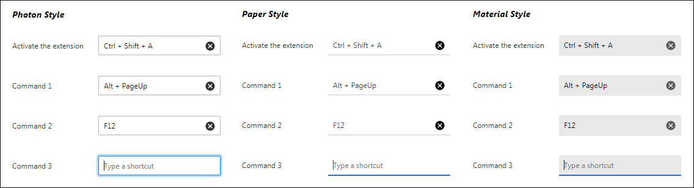
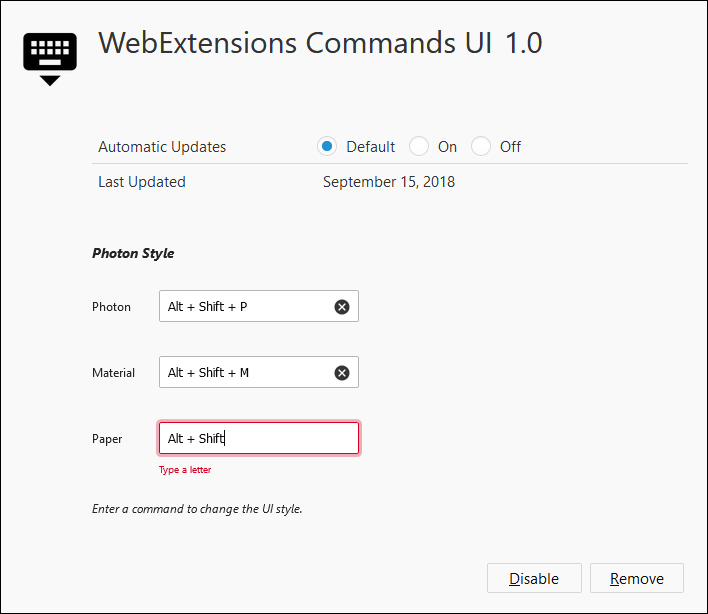

# WebExtensions Commands UI
This is a UI for WebExtensions that lets users configure commands (keyboard shortcuts). It's only a temporary solution until Firefox [finishes implementing a native UI](https://bugzilla.mozilla.org/show_bug.cgi?id=1303384).
It works by translating [KeyboardEvent.key](https://developer.mozilla.org/docs/Web/API/KeyboardEvent/key) and [KeyboardEvent.code](https://developer.mozilla.org/docs/Web/API/KeyboardEvent/code) input into [WebExtensions Commands](https://developer.mozilla.org/docs/Mozilla/Add-ons/WebExtensions/API/commands) strings.

The total size is 3.96 KB compressed.

## Styles
There are three types of UI styles you can choose from:

1. `photon` based on [Photon Design](https://design.firefox.com/photon/components/input-fields.html) and Firefox
2. `paper` based on [Material-UI Paper](https://material-ui.com/demos/text-fields/) and Chrome Pre-69
3. `material` based on [Material Design](https://material.io/design/components/text-fields.html) and Chrome 69+

This is a screenshot of all three styles laid out side by side.

*Input sizes are consistent between styles and have a 200px width, 32px height, and 8px padding by default*

## Installation
1. [Define the commands in manifest.json](https://developer.mozilla.org/docs/Mozilla/Add-ons/WebExtensions/manifest.json/commands) (define a`name` and `description`, but don't define a `suggested_key` for them!)
2. Add `webextensions-commands-ui.js`, `webextensions-commands-ui.css`, `webextensions-commands-ui-clear-circle.png`
3. In `options.html`, include the CSS and JS, and add this HTML: `

` (or `paper` or `material`)

*Optional: In the CSS file, you may change the `clear-image` url path, adjust the colors/styles, or in the JS file, change the `I18N` strings to point to `browser.i18n.getMessage()`.*

## Demo
The `src` directory contains a demo extension you can install as a temporary add-on in Firefox.
It lets you issue commands to change the UI style.

## Supported Keys
Shortcuts should match [this supported list of shortcut values](https://developer.mozilla.org/en-US/docs/Mozilla/Add-ons/WebExtensions/manifest.json/commands#Shortcut_values).

The three [special shortcuts](https://developer.mozilla.org/en-US/docs/Mozilla/Add-ons/WebExtensions/manifest.json/commands#Special_shortcuts) `_execute_browser_action`, `_execute_page_action`, and `_execute_sidebar_action` are all supported but you'll need to add a `description` for them in `manifest.json`.

## Clearing Commands
Clicking the clear (X) button clears the command, with one minor requirement! Firefox does not offer an API to `clear` a command. Instead, they offer an API to `reset` a command back to its default `suggested_key` in the `manifest.json`.
But there is a workaround to this! If you don't put in a `suggested_key` and a reset is performed, the command is cleared.
So, in order to allow users to clear commands, just don't enter a `suggested_key`.

## Command Collisions
If the user enters a command shortcut that already exists, the component will gracefully handle collisions within your extension by clearing the old command's shortcut.
Commands from other extensions can't be accessed, so unfortunately collisions can't be handled in those cases.

## Notes
1. **Mac** is untested, but the code is in place to support all Mac-specific modifiers including `Command` and `MacCtrl`
2. **Multiple keyboard layouts** (such as QWERTY, AZERTY, or Dvorak) should mostly be supported as `KeyboardEvent.key` (the generated key) is prioritized first over `KeyboardEvent.code` (the physical key location) in the `Map` lookup
2. **Numpad** is unimplemented, but this would only entail supporting the alternate and less-used locations for Home, End, Page Up, Page Down